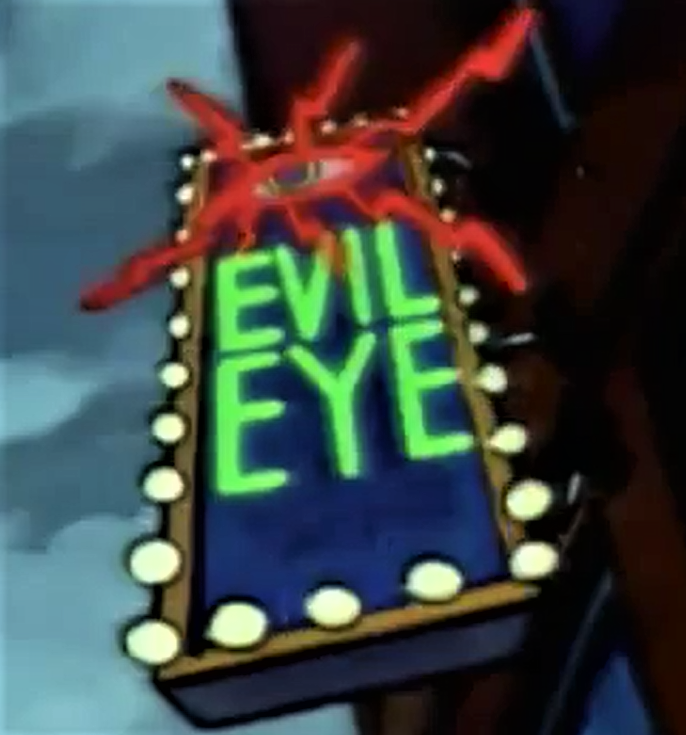

# EvilEye

"You popped a shell - now what?" 

EvilEye is a post-exploitation toolkit to check for "next hop" lateral movement vectors in Active Directory environments. 
It's designed and tested to be deployed either as a simple executable or by execute-assembly in Cobalt Strike/Sliver/etc. (I am too poor to afford Cobalt Strike, so the latter has only been tested with Sliver)

⚠️ **DISCLAIMER** ⚠️
EvilEye is an experimental tool written by someone who fully comprehends neither Active Directory nor C#, and is intended as a learning experience and convenience wrapper. Use it with caution. Suggestions/contributions are welcomed. 
